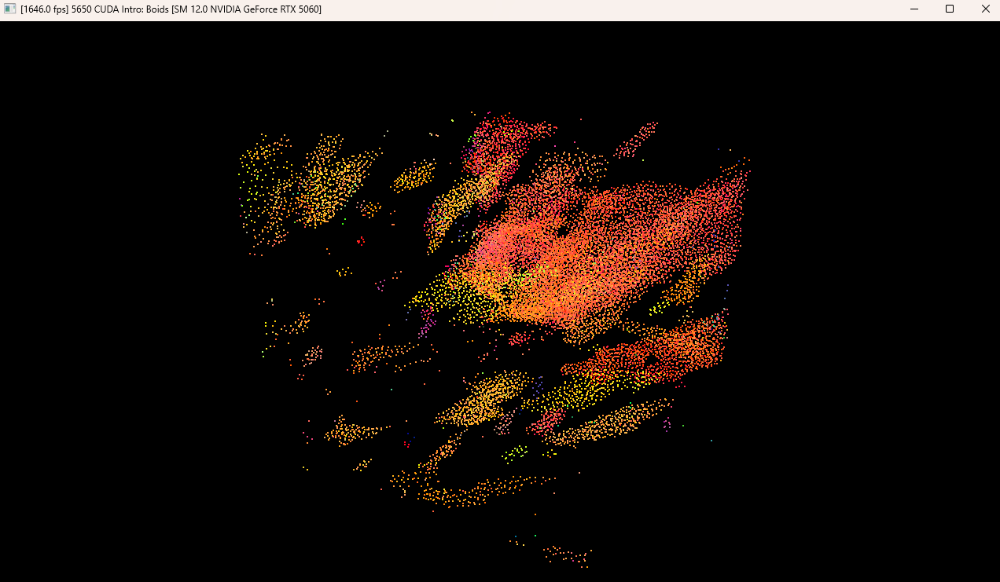
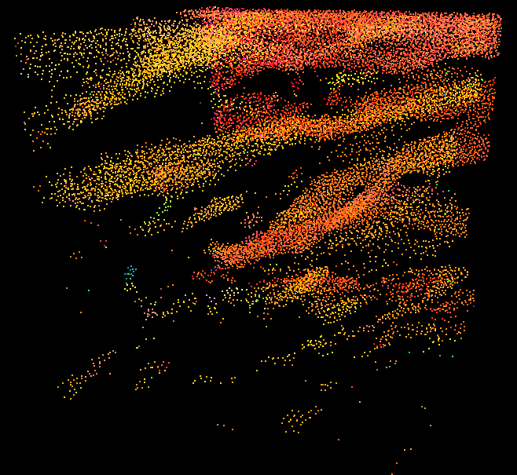
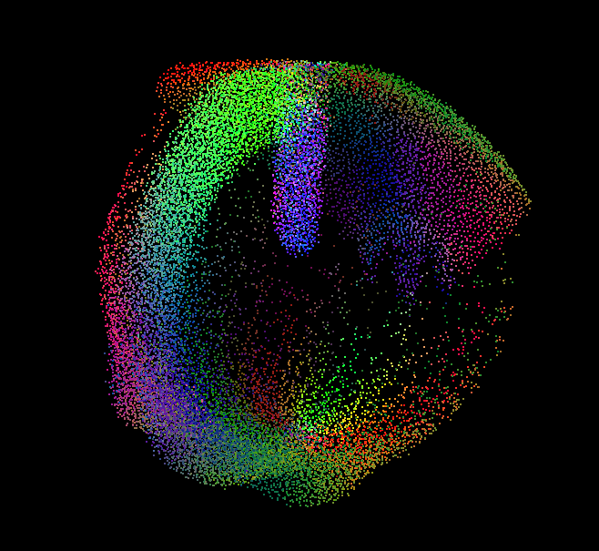
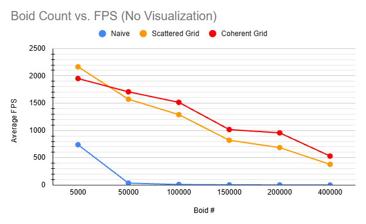
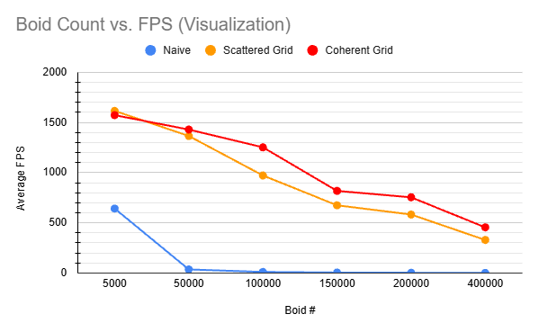
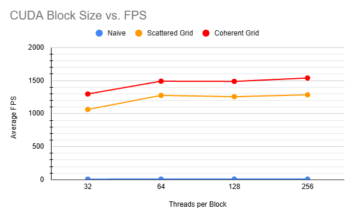
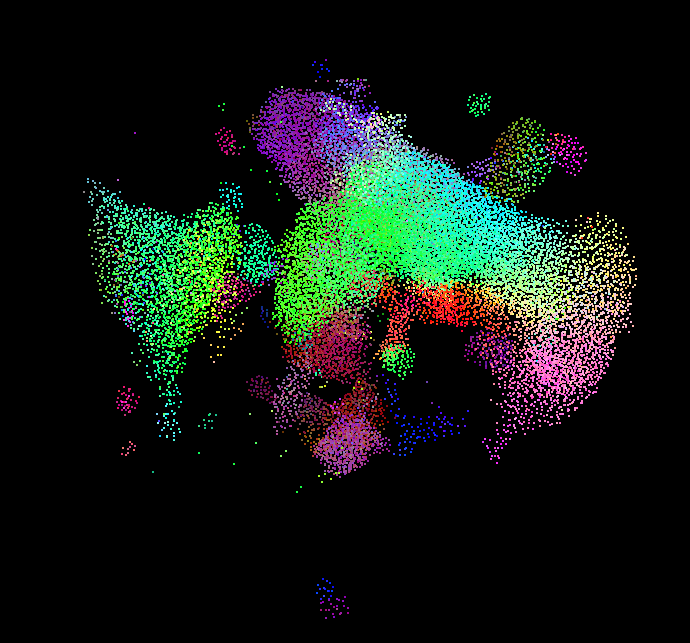
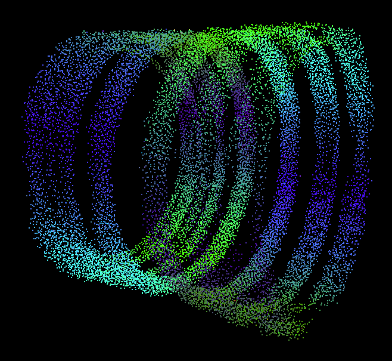
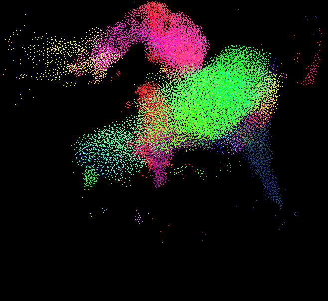

**University of Pennsylvania, CIS 5650: GPU Programming and Architecture,  
Project 1: Flocking**

* Kevin Du
  * [LinkedIn](https://www.linkedin.com/in/kevinwdu/), [personal website](kevindu.dev)
* Tested on: Windows 11, Intel Core Ultra 5 225F @ 3.30 GHz 32 GB, RTX 5060 (8 GB)

CUDA implementation of a 3D boids simulation with brute-force, scattered-grid, and coherent-grid neighbor searches.

|  |  |
|:---:|:---:|

## Implementation

- CUDA-based boid simulation with cohesion, separation, and alignment rules
- Naive brute-force neighbor search
- Scattered uniform-grid neighbor search using Thrust sorting
- Coherent uniform-grid neighbor search with position and velocity data reordered by grid cell
- CUDA kernels for:
  - Computing grid-cell indices
  - Sorting boids by grid cell
  - Reshuffling boid data into coherent memory order
  - Updating boid velocities and positions
- Configurable CUDA block size
- Attractor-based vector fields

## Performance Analysis

Data was collected from Release x64 builds with vertical synchronization disabled. The reported FPS values are averages of five readings taken after the simulation stabilized. Boid-count tests use a block size of 128 threads, while block-size tests use 100,000 boids without visualization.

### Boid Count without Visualization

| Boid Count | Naive FPS | Scattered FPS | Coherent FPS |
|---:|---:|---:|---:|
| 5,000 | 739.4 | 2,166.0 | 1,950.4 |
| 50,000 | 36.2 | 1,571.8 | 1,707.3 |
| 100,000 | 10.7 | 1,290.1 | 1,514.7 |
| 150,000 | 4.9 | 820.7 | 1,016.4 |
| 200,000 | 2.9 | 686.6 | 956.2 |
| 400,000 | 0.7 | 380.3 | 531.3 |

The FPS of the naive method decreases drastically as the boid count increases. Because each boid searches through every other boid, the amount of work scales quadratically, causing the FPS to decrease rapidly.

The grid-based optimizations reduce the number of boid comparisons by limiting the search to nearby grid cells. Consequently, the amount of work grows more slowly as the boid count increases. The overhead of reordering the position and velocity arrays means that the coherent-grid implementation performs worse than the scattered-grid implementation at lower boid counts. At higher boid counts, however, the benefits of coherent memory access become more significant.

### Boid Count with Visualization

| Boid Count | Naive FPS | Scattered FPS | Coherent FPS |
|---:|---:|---:|---:|
| 5,000 | 642.2 | 1,615.2 | 1,572.5 |
| 50,000 | 35.7 | 1,365.1 | 1,429.1 |
| 100,000 | 10.6 | 971.7 | 1,252.3 |
| 150,000 | 4.8 | 674.7 | 818.2 |
| 200,000 | 2.8 | 582.6 | 754.0 |
| 400,000 | 0.7 | 329.4 | 454.9 |

With visualization enabled, FPS decreases more noticeably at higher boid counts because each frame must both update and render more boids. These workloads compete for GPU resources, increasing the total time required per frame. The trends observed without visualization are also present here.

### Block Size

| Block Size | Naive FPS | Scattered FPS | Coherent FPS |
|---:|---:|---:|---:|
| 32 | 9.2 | 1,062.8 | 1,297.5 |
| 64 | 10.7 | 1,276.4 | 1,491.3 |
| 128 | 10.7 | 1,256.4 | 1,487.9 |
| 256 | 10.4 | 1,285.6 | 1,539.3 |

Block size had a relatively small effect on FPS, with 32-thread blocks performing worst. A 32-thread block contains only one warp, providing less scheduling flexibility and fewer opportunities to hide memory latency during neighbor searches. Compared with 128-thread blocks, 256-thread blocks performed marginally better for both 100,000 and 200,000 boids, but slightly worse for 20,000 boids. This difference may be due to measurement noise. Larger blocks can improve latency hiding, but they may also reduce occupancy if they consume too many registers or other per-block resources.

### Scattered vs. Coherent Grid

#### Overall Performance

| Boid Count | Scattered FPS (Visualization) | Coherent FPS (Visualization) | Scattered FPS (No Visualization) | Coherent FPS (No Visualization) |
|---:|---:|---:|---:|---:|
| 5,000 | 1,615.2 | 1,572.5 | 2,166.0 | 1,950.4 |
| 50,000 | 1,365.1 | 1,429.1 | 1,571.8 | 1,707.3 |
| 100,000 | 971.7 | 1,252.3 | 1,290.1 | 1,514.7 |
| 150,000 | 674.7 | 818.2 | 820.7 | 1,016.4 |
| 200,000 | 582.6 | 754.0 | 686.6 | 956.2 |
| 400,000 | 329.4 | 454.9 | 380.3 | 531.3 |

#### Neighbor-Search Kernel Time

Boid count: **100,000**; block size: **128 threads per block**.

| Implementation | Neighbor-Search Kernel Time (ms) |
|---|---:|
| Scattered | 0.325 |
| Coherent | 0.187 |

As expected, the coherent grid outperforms the scattered grid at higher boid counts, where improved memory locality produces more efficient global-memory accesses and reduces neighbor-search time. At lower boid counts, however, the per-frame cost of reordering the position and velocity arrays can outweigh these benefits, making the scattered grid faster overall. At a boid count of 1 million, the coherent grid implementation is a 40% improvement over the scattered implementation, at roughly 140 fps vs 100 fps.

### Effects of Cell Width

At 100,000 boids, halving the cell width and checking up to 27 cells increased FPS by more than 100. At the lower boid count of 20,000, the 27-cell neighbor search also improved FPS, although the improvement was less noticeable.

Halving the cell width increases the search from 8 to as many as 27 cells, but each cell has one-eighth the volume and therefore contains fewer boids. The kernel performs more cell-range lookups but fewer expensive distance calculations and flocking-rule evaluations. At 100,000 boids, the higher density makes this reduction in candidate boids substantial, producing a noticeable FPS improvement.

## Additional Features

### Dynamic Neighbor-Cell Iteration

Instead of hard-coding a fixed set of neighboring cells, the neighbor-search kernels compute the minimum and maximum grid-cell indices touched by the boid's maximum interaction distance along each axis. The kernel then iterates over the resulting three-dimensional range of cells. This makes the search independent of a fixed number such as 8 or 27 cells.

### Attractor Vector Fields

Optional strange-attractor vector fields can be enabled to influence the boids' velocity updates. The vector field is evaluated at each boid's position and added to its acceleration, allowing the flock to form interesting patterns around attractors such as Lorenz, Thomas, Halvorsen, and Sprott B.

|  |  |  |
|:---:|:---:|:---:|
| Lorenz | Thomas | Sprott B |
